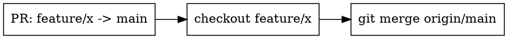

# Resolving PR Merge Conflicts

## Overview

Resolve the merge conflicts on a PR locally so it *becomes* mergeable — then hand it back. **Core principle: this skill stops at a resolved, verified, locally-committed merge. It NEVER publishes.**

## Scope Boundary (hard stop)

**This skill resolves conflicts. It does NOT push, force-push, or merge the PR.**

Finishing point = conflicts resolved + verified + a local merge commit. Then report to the user and stop. Publishing is the user's decision, not this skill's.

The `allowed-tools` list deliberately omits `git push`, `git rebase`, `git reset`, and `gh pr merge`. If you reach for one, you are leaving scope — stop instead.

## Direction: which branch do you work on?

A PR merges **HEAD → BASE** (e.g. `feature/x` → `main`). To resolve its conflicts you do the OPPOSITE locally: **check out HEAD and merge BASE into it.**



**TRAP:** Even if the human says "merge X into main", do NOT `git checkout main && git merge X`. That resolves conflicts on `main`, not on the PR, and tempts a push to `main`. Always work on the **HEAD (PR) branch**.

## Target branch (required input — ask if missing)

**Before doing anything, you MUST know which PR / HEAD branch to work on.** It comes from the skill argument or an explicit branch/PR in the user's message.

If no target was given, **STOP and ask the user which PR or branch to resolve.** Do NOT guess, do NOT `gh pr list` and pick one, do NOT fall back to the currently checked-out branch. Asking once is cheaper than resolving conflicts on the wrong PR.

## Workflow

0. **Confirm the target.** A specific PR / HEAD branch must be known (see above). If not, ask first — do not proceed.
1. **Fetch first.** `git fetch origin --prune`. The remote PR branch may have been rebased/force-pushed since you last looked (dependabot does this routinely).
2. **Check out the PR (HEAD) branch**, tracking the remote: `git checkout -b <head> origin/<head>` (or `git checkout <head>`).
3. **If local HEAD diverges from `origin/<head>`** (remote was force-pushed): STOP and report. Realigning needs a destructive reset — that is the user's call, not yours.
4. **Merge the base in:** `git merge --no-ff origin/<base>`. Conflicts appear.
5. **Resolve source files by hand** (union of intent: keep both new entries; pick the intended version when both bumped the same dep), then `git add <file>`.
6. **Resolve generated lockfiles by REGENERATING, never by hand** (see below).
7. **Verify** (see below).
8. **Commit the merge locally:** `git commit --no-edit`. **Do not push.**
9. **Report**: what conflicted, how you resolved it, verification results, and that it is committed locally and ready for the user to push.

## Generated / lock files

Never hand-edit conflict markers in `pnpm-lock.yaml` / `package-lock.json` / `yarn.lock`. They are generated — resolve the source of truth (`package.json`) first, then regenerate so the lockfile matches exactly:

```bash
git checkout --theirs pnpm-lock.yaml      # take one marker-free side as a base
pnpm install --no-frozen-lockfile         # regenerate from resolved package.json
git add pnpm-lock.yaml
```
(npm: `npm install`; yarn: `yarn install`.)

## Verification (before committing)

```bash
git diff --check                          # no leftover conflict markers
pnpm install --frozen-lockfile            # proves lockfile matches package.json (CI's check)
pnpm lint
pnpm test
```
(npm: `npm ci`; yarn: `yarn install --immutable`.)

## Red Flags — STOP

- "No branch was named, but I'll just pick the open PR / current branch" → **ask first.** Resolving the wrong PR wastes the whole effort.
- "The PR is ready, I'll just push it" → **out of scope.** Commit locally, hand back.
- "I'll `gh pr merge` to finish the job" → **out of scope.**
- "The remote was force-pushed, I'll `git reset --hard`" → **report, don't reset.**
- "I'll `git rebase` onto main instead" → produces history that needs a force-push → **out of scope; use merge.**
- "The human said merge X *into main*, so I'll check out main" → **work on the HEAD branch instead.**
- "I'll hand-edit the lockfile to clear the markers" → **regenerate it.**

## Common Mistakes

| Mistake | Fix |
|---|---|
| Starting without a named target branch | Ask the user which PR/branch first; never guess |
| Resolving on `main` / base branch | Check out the HEAD (PR) branch; merge base into it |
| Hand-editing lockfile | Regenerate from resolved `package.json` |
| Skipping `git fetch` | Remote PR branch may be rebased; fetch before acting |
| Force-pushing over an upstream rebase | Never; if diverged, stop and report |
| Pushing / merging the PR | Out of scope — stop at the local merge commit |
